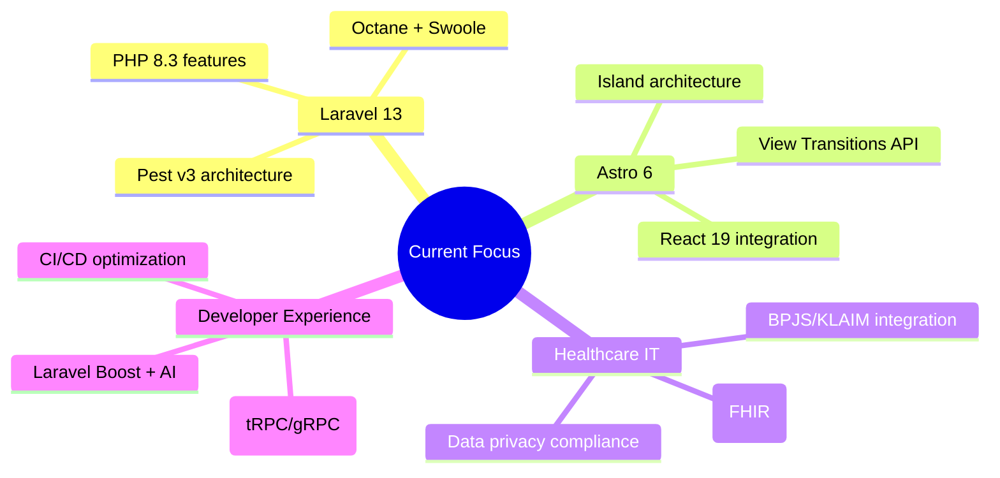

# Rizal Prananda

<p align="center">
  
</p>

<p align="center">
  <a href="https://github.com/Rizal-Prananda">
    
  </a>
  <a href="https://github.com/Rizal-Prananda?tab=repositories">
    
  </a>
  <a href="https://github.com/Rizal-Prananda/ecommerce-vfull">
    
  </a>
  <a href="https://github.com/Rizal-Prananda/Rizal-Prananda">
    
  </a>
  <a href="https://github.com/Rizal-Prananda?tab=followers">
    
  </a>
  <a href="https://github.com/Rizal-Prananda?tab=repositories">
    
  </a>
</p>

<p align="center">
  
</p>

---

## About Me

```typescript
interface Engineer {
  name: string;
  role: string;
  company: string;
  location: string;
  focus: string[];
  currently: string[];
  philosophy: string;
}

const rizal: Engineer = {
  name: "Rizal Prananda",
  role: "IT System Analyst",
  company: "Oetomo Hospital",
  location: "Bandung, Indonesia",
  focus: [
    "Healthcare Information Systems",
    "E-commerce & CMS Platforms",
    "Laravel + Astro Ecosystem",
    "System Architecture & Integration"
  ],
  currently: [
    "Building ecommerce-vfull (Laravel 13 + Astro 6)",
    "Modernizing healthcare IT infrastructure",
    "Exploring Astro + React island architecture",
    "Deepening Laravel 13 + PHP 8.3 expertise"
  ],
  philosophy: "Clean architecture over clever code. Developer experience is a feature."
};
```

---

## Tech Stack

<p align="center">
  
</p>

### Backend & Architecture
<p align="center">
  
  
  
  
  
</p>

### Frontend & Tooling
<p align="center">
  
  
  
  
  
</p>

### UI & DX Libraries
<p align="center">
  
  
  
  
  
</p>

### Auth & Security
<p align="center">
  
  
</p>

### Dev Tools & Quality
<p align="center">
  
  
  
  
  
</p>

---

## GitHub Analytics

<p align="center">
  
  
</p>

<p align="center">
  
</p>

<p align="center">
  
</p>

<p align="center">
  
</p>

---

## Featured Projects

### 🛍️ ecommerce-vfull — Full-Stack E-commerce Platform
**Monorepo** • Laravel 13 (CMS/Backend) + Astro 6 (Frontend) + Prisma ORM

<p align="center">
  <a href="https://github.com/Rizal-Prananda/ecommerce-vfull">
    
    
    
    
  </a>
</p>

| Component | Stack | Description |
|-----------|-------|-------------|
| **apps/cms-laravel** | Laravel 13, PHP 8.3, Pint, Pest | Admin CMS, API backend, queue workers |
| **apps/compro-astro** | Astro 6, React 19, TypeScript, Tailwind 4 | Company profile frontend, SSR + Islands |

**Key Features:**
- 🏗️ **Monorepo architecture** with shared Prisma schema
- 🔐 **JWT Auth (JOSE)** + bcrypt password hashing
- 📦 **Prisma ORM** with PostgreSQL/SQLite support
- 🎨 **Modern UI**: Radix UI primitives, Lucide icons, Sonner toasts
- 📄 **PDF Generation** with PDFKit for invoices/reports
- 🔄 **Real-time** via Laravel queues + WebSocket integration
- 🧪 **Testing**: Pest (PHP), TypeScript strict mode, ESLint + Prettier

---

### 🏥 Healthcare IT Systems (Private)
**Oetomo Hospital** • Internal Systems

| System | Stack | Domain |
|--------|-------|--------|
| E-Klaim / BPJS Integration | Laravel, PostgreSQL | Insurance claims processing |
| SI Tools IT | Laravel, Astro | Internal IT asset management |
| HRIS / E-Recruitment | Laravel, SQLite | Applicant tracking, recruitment |
| Ticketing System | Laravel | IT support ticketing |

---

## Current Focus



---

## Connect

<p align="center">
  <a href="https://github.com/Rizal-Prananda">
    
  </a>
  <a href="https://linkedin.com/in/rizal-prananda">
    
  </a>
  <a href="mailto:rizal.prananda@oetomo.com">
    
  </a>
  <a href="https://twitter.com/nobita">
    
  </a>
</p>

---

## Profile Visitors

<p align="center">
  
</p>

---

<p align="center">
  
</p>

<p align="center">
  <sub>Built with ❤️ by <a href="https://github.com/Rizal-Prananda">Rizal Prananda</a> • IT System Analyst @ Oetomo Hospital</sub>
</p>